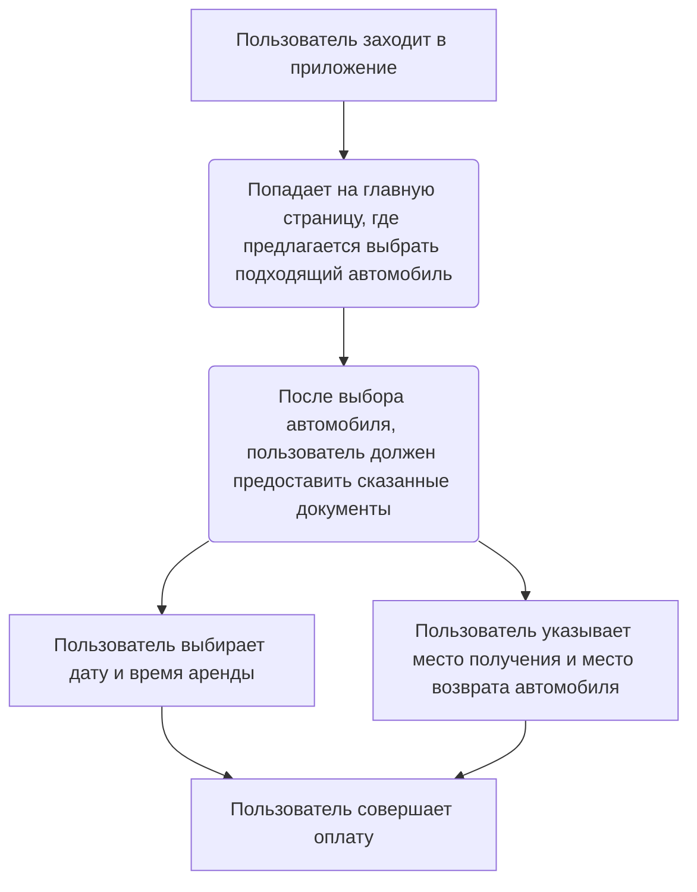

```mermaid
flowchart TD
    A[Пользователь заходит в приложение] --> B(Попадает на главную страницу, где предлагается выбрать подходящий автомобиль)
    B --> C(После выбора автомобиля, пользователь должен предоставить сказанные документы)
    C --> D[Пользователь выбирает дату и время аренды]
    C --> E[Пользователь указывает место получения и место возврата автомобиля]
    D --> F
    E --> F[Пользователь совершает оплату]
```
    
